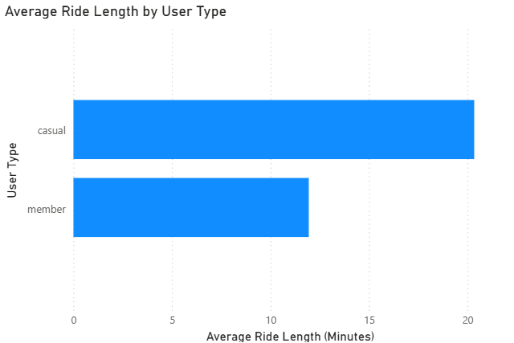
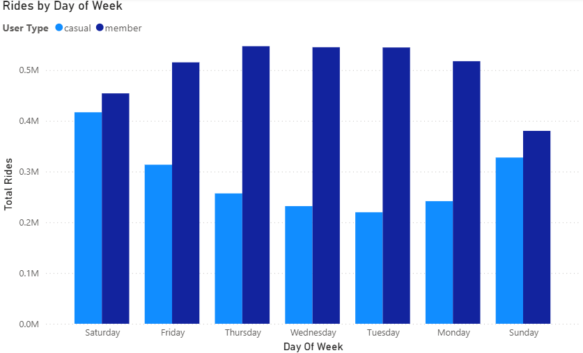
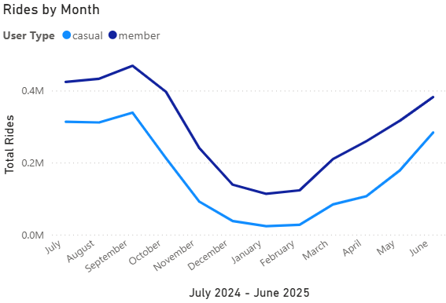

# Cyclistic-Case-Study

**Role:** Data Analyst 
• **Tools:** SQL Server, Power BI, Excel • 
**Timeline:** [08 2025]  
**Goal:** Use 12 months of trip data to understand how **annual members** and **casual riders** differ, and recommend actions to grow memberships.

---

## Business Task
Increase annual memberships by identifying ride behavior differences and actionable levers in product, pricing, and marketing.

## Data
- Source: Cyclistic (Divvy) public trip data, 12 CSVs ([2024-07 to 2025-06])
- Rows: ~[5,597,025] rides • Columns: 13
- Scope: Chicago area shared bikes
- Privacy: Aggregated, public, no PII

## Tools & Stack
- **Excel:** quick profiling/cleaning
- **SQL Server (SSMS):** cleaning, joining, transformations  
- **Power BI:** visualization & dashboard
- **GitHub** – Portfolio hosting & documentation  

## Method (Google DA 6 Steps)
1. **Ask** – How do annual members and casual riders use Cyclistic bikes differently?
   
3. **Prepare** – Reviewed 12 CSV files in Excel for initial profiling
   
5. **Process** – 
   **Excel**:  
     - Removed duplicates 
     - Dropped `start_station_name` and `end_station_name` because over 20% values were NULL  
     - Added `day_of_week` and `month` helper columns   
   **SQL**:
   - Imported 12 CSV files in SQL Server and combined into 1 table
   - Drop rides with `started_at > ended_at`
   - Exclude durations ≤ 0 or > 24 hours
   - Created a clean analysis table `tripdata_cleaned`
     
6. **Analyze**
   Key SQL queries performed:
   - Average ride length by user type  
   - Ride volume by weekday and month (seasonality trends)  
   - Bike type usage (classic, docked, electric) by user type  
   - Distribution of rides by member vs casual
     
   **Summary of Analysis:**
   
   Average Ride Duration:
   - Members: 11 minutes
   - Casual Riders: 20 minutes
     
   Most Popular Days:
   - Members: Tuesday–Thursday
   - Casual Riders: Saturday & Sunday
     
   Rideable Type Preference:
   - Members & Casual riders favor electric bikes
     
   Usage Patterns:
   - Members ride more on weekdays (commuters)
   - Casual riders ride more on weekends (leisure)
     
8. **Share**
   - Built a **Power BI dashboard** to visualize differences between user groups  
   - Exported key visuals (see below)
    
10. **Act** 
  **Recommendations:**
- Target marketing campaigns on weekends (casual riders’ peak usage)
- Run retargeting ads on social media for casual riders with >3 rides/month.
- Promote discounted weekday plans to casual riders
- Introduce multiple membership passes (weekend passes, seasonal passes etc)
- Highlight cost savings and commuting advantages of membership using traditional bikes.

## Power BI Dashboard
- PDF version available here: Power BI/Dashboard.pdf
- Full `.pbix` file is shared via [Google Drive](https://drive.google.com/file/d/1R6CezjmTBIR812zu2wBPbXQ_yN2RoYy-/view?usp=drive_link)
- Sample visuals:

    
    
  

## Data Sample
A cleaned subset of 1000 rows is included in (Data Sample/Cleaned data sample.csv).  
Full raw dataset can be accessed from [Divvy/Cyclistic Public Data](https://divvy-tripdata.s3.amazonaws.com/index.html).

## Author
**Melvin Philip**  
- 📧 Email: melvin.philip108@gmail.com  
- 🔗 [LinkedIn](linkedin.com/in/melvin-philip1)  

